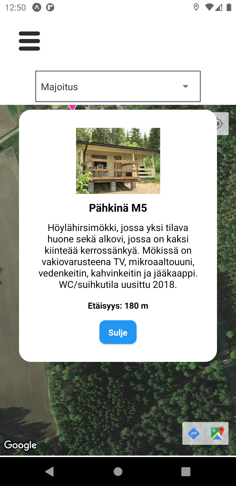

# Iloranta

This is mobile application that was produced in school in a team of four people. The original repository can be found [here](https://github.com/JuliaIkaheimo/Iloranta).
The project was eight weeks long and it contained meetings with our client, planning, designing, programming and writing documentation. The project was managed with Scrum.

|Table of contents|
|:------------- |
|1. [Technical solutions of the application](#Technical-solutions-of-the-application)|
|2. [Pictures of the user interface](#Pictures-of-the-user-interface)|
|3. [Attribution](#Attribution)|
|4. [My responsibilities in the project](#My-responsibilities-in-the-project)|

## Technical solutions of the application
We used **React Native** to build this application.

## Pictures of the user interface
Here you can see a few images of the UI.

  
   
   
 

### Examples of the different language versions:
       

## Attribution
The images of the places in Iloranta are Iloranta's own images. The icons of the application are from Flaticon. 

Social media icons:
- [Facebook](https://www.flaticon.com/free-icon/facebook_1051309?term=facebook&page=1&position=12&page=1&position=12&related_id=1051309&origin=search)
- [Instagram](https://www.flaticon.com/free-icon/instagram_1384031?term=instagram&page=1&position=8&page=1&position=8&related_id=1384031&origin=search)
- [YouTube](https://www.flaticon.com/free-icon/youtube_1384028?term=youtube&page=1&position=16&page=1&position=16&related_id=1384028&origin=search)
- [Tripadvisor](https://www.flaticon.com/free-icon/tripadvisor-logotype_48942?term=tripadvisor&page=1&position=2&page=1&position=2&related_id=48942&origin=search)

Language icons:
- [English](https://www.flaticon.com/free-icon/united-kingdom_197374?term=english&page=1&position=6&page=1&position=6&related_id=197374&origin=search)
- [Swedish](https://www.flaticon.com/free-icon/sweden_197564?term=swedish&page=1&position=5&page=1&position=5&related_id=197564&origin=search)
- [German](https://www.flaticon.com/free-icon/germany_197571?term=germany&page=1&position=1&page=1&position=1&related_id=197571&origin=search)
- [Finnish](https://www.flaticon.com/free-icon/finland_197585?term=finland&page=1&position=3)

Other icons:
- [Contact page](https://www.flaticon.com/free-icon/conversation_942802?term=question&page=1&position=4&page=1&position=4&related_id=942802&origin=search)
- [Navigation bar](https://www.flaticon.com/free-icon/star_786331?term=star&page=1&position=11&page=1&position=11&related_id=786331&origin=search)
- [Navigation bar 2](https://www.flaticon.com/free-icon/menu-button-of-three-horizontal-lines_56763?term=hamburger%20menu&page=1&position=11&page=1&position=11&related_id=56763&origin=search)
- [Arrival page](https://www.flaticon.com/premium-icon/parking-sign_1072562?term=parking&page=1&position=9&page=1&position=9&related_id=1072562&origin=search)
- [Arrival page 2](https://www.flaticon.com/free-icon/location_1518062?term=arrive&page=1&position=20&page=1&position=20&related_id=1518062&origin=search)

## My responsibilities in the project
In this project I was responsible of designing and programming the navigation bar, arrival page and contact page. I also programmed the modals to the map page that show the information of the places in Iloranta. During the project I was also helping my team member to build the multi-language support.
